# robotframework-jenkins-run
This is a simple project to show how to integrate robot run in jenkins with freestyle project. Robotframework-jenkins-run also provide step by step to poll scm push to trigger the build.
It also helps on using [robotframework-metrics](https://pypi.org/project/robotframework-metrics/) to view the dashboard report on jenkins.

# Table of contents
1. [Pre-requisites](#preRequisites)
2. [Steps in Jenkins](#jenkinsStep)
3. [Email Notification configuration](#emailnotification)

[Troubleshooting viewing report](#Troubleshoot_viewreport)

## 1. Pre-requisites <a name=""></a>
* Clone this project on your local computer.
```
https://github.com/Anilkumar-Shrestha/robotframework-jenkins-run.git
```
* install Jenkins on your PC. for installation, follow steps as: [install jenkins on windows](https://dzone.com/articles/how-to-install-jenkins-on-windows)
* Go to "Manage plugins" in left bar and click on "plugin Manager". You will see the horizontal bar, click on available and type "Robot Framework plugin" on search bar. Install the plugin without restart.
 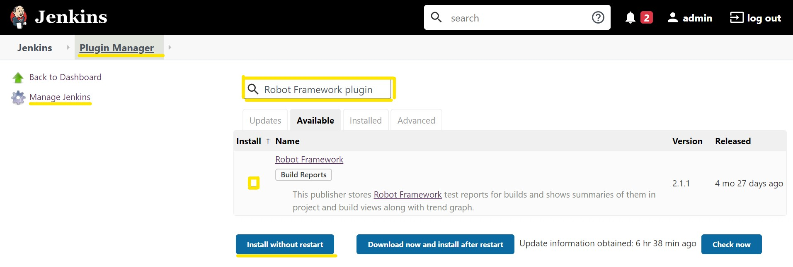

## 2. Steps in Jenkins <a name="jenkinsStep"></a>

* Create New item.
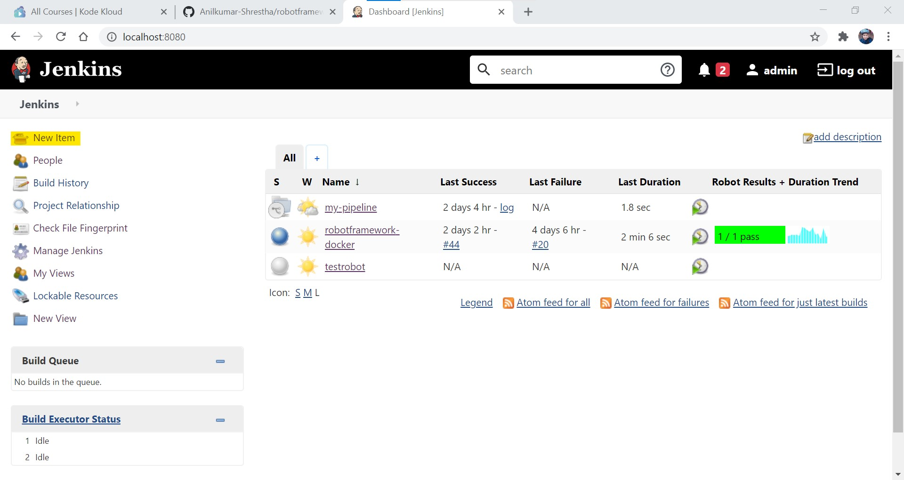
* Give a suitable project name and select the free style project and click on OK button as shown.
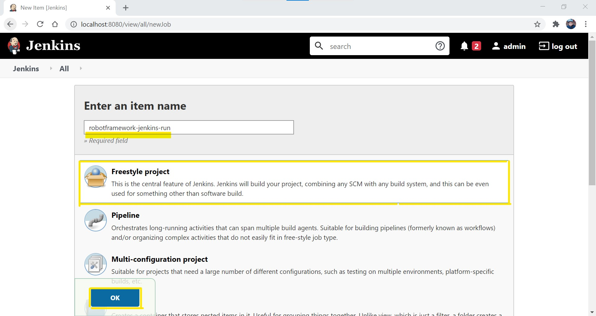
* Go to Source code management and select Git radiobutton. Provide the repos url and give your credentials.
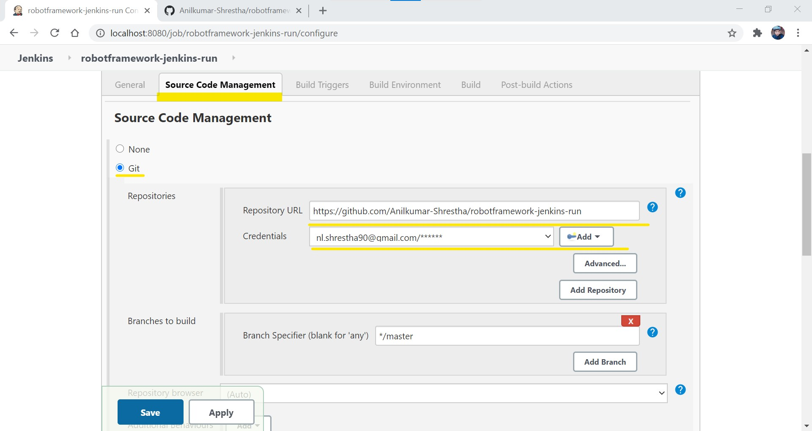
> *for Credential setting, please see the link [Adding credentials](https://www.jenkins.io/doc/book/using/using-credentials/)*
* Go to Build trigger and select the Poll SCM button and enter 5 * with spaces to check changes in every minutes.
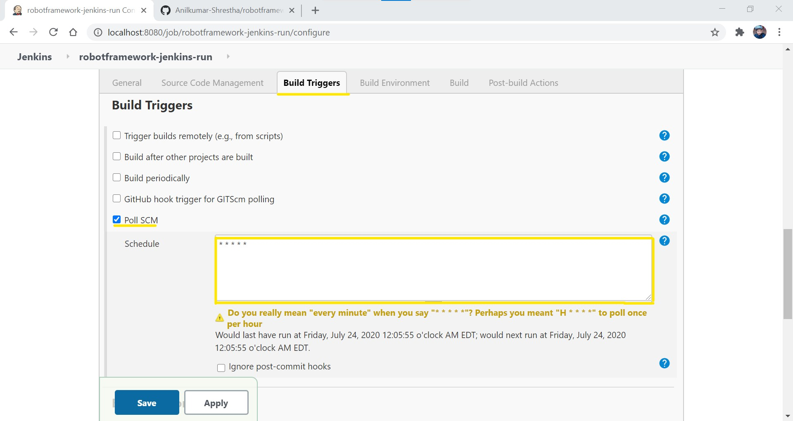
* Go to Build and click on Add build steps. It pop up the list where you should click on "Execute Window batch Command".
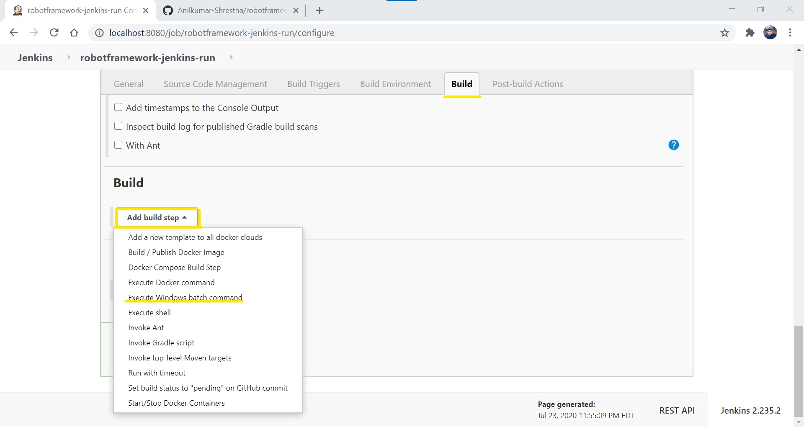
* Enter the below batch cmd on the command box as shown.
```
robot --outputdir testresults/ requestTest.robot &
robotmetrics -M outputReportMetrics.html --inputpath ./testresults/ --output output.xml --log log.html
```
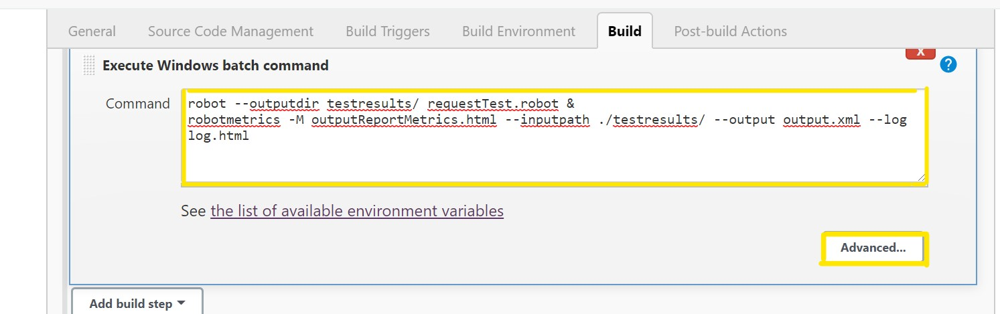
* Go to Post-build Actions and click on Add build steps. Select "Publish robot framework test results".
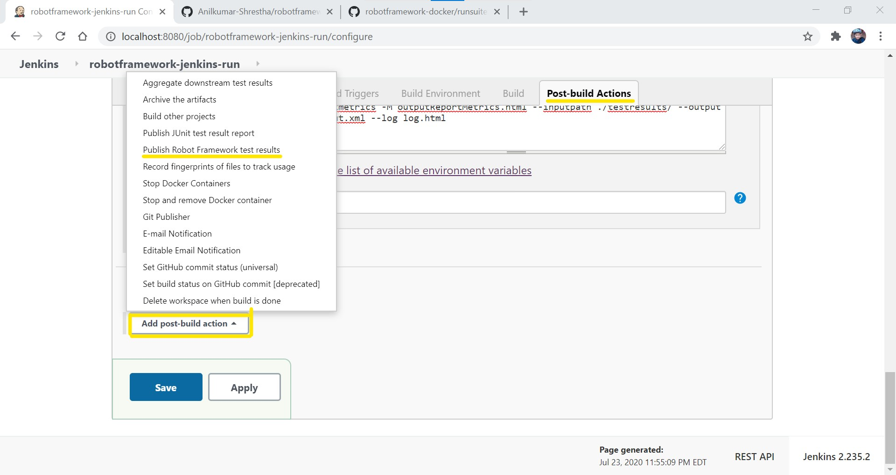
* Add testresults in directory and outputReportMetrics.html on Other files to copy box. CLick Save.
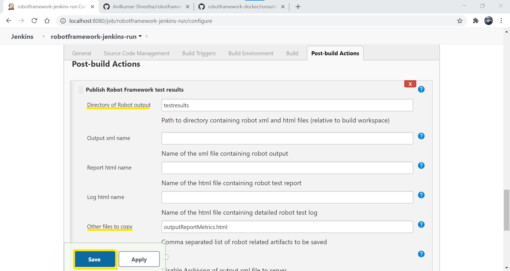

* Now, trigger job using Build Now.
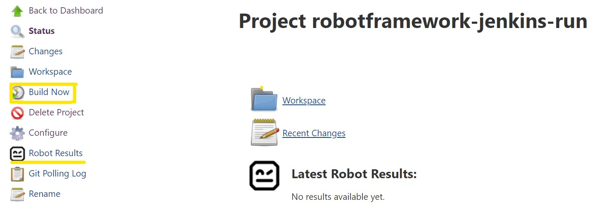
> > * After build is complete, click on Robot results.
> > * Click on Original result files.
> > * Open "outputReportMetrics.html" report.


## Email Notification configuration <a name="emailnotification"></a>
If you want to configure the email notification in each build to the concern team member, we can achieve it through Jenkins.
For this, please follow below steps for configuring.

1. Adding Plugin and Configuring mail server.
    1.    We need the "Email extension Plugin" to install in jenkins. For this, Go to "Manage plugins" in left bar and click on "plugin Manager". You will see the horizontal bar, click on available and type "Email extension Plugin" on search bar. Install the plugin without restart.
     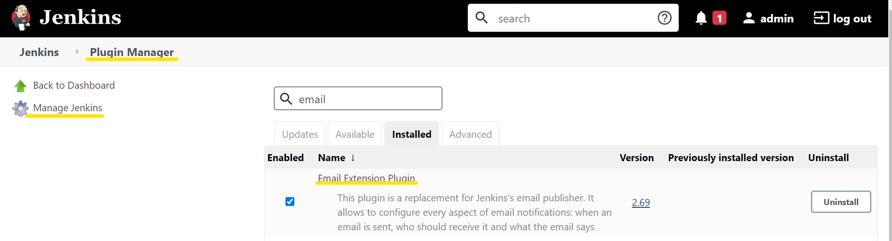
    2.    You need to configure the smtp server. Go to Manage Jenkins and click on configure system.
     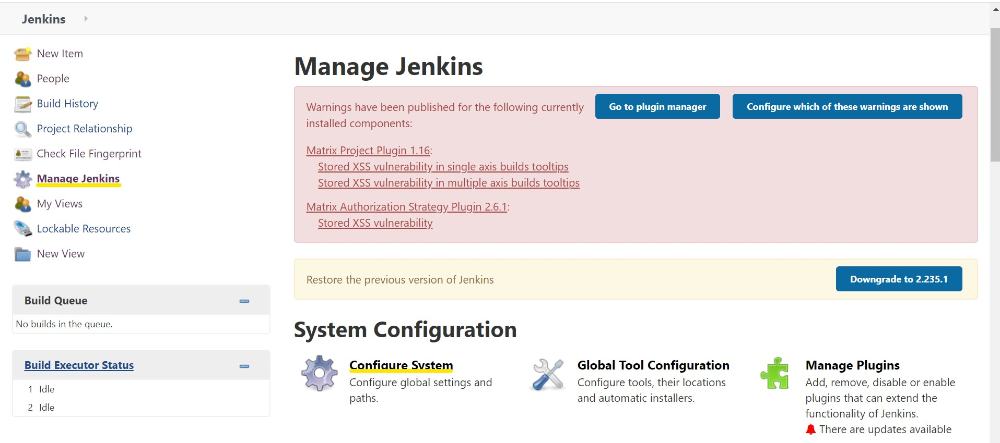
    3.    Search for "Extend" and you will land to email configure page. Add All the information as highlighted. i.e
        > * Enter your smtp server name. For example I have entered google. You can check [this site](https://www.arclab.com/en/kb/email/list-of-smtp-and-pop3-servers-mailserver-list.html) for more information on other smtp server.
        > *  Click “Use SMTP Authentication” and enter required information.
        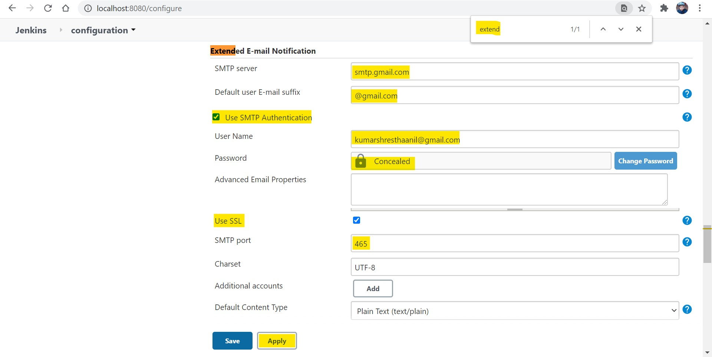
    4.    Enter the similar information in E-mail notifications. You can check Check “Test configuration by sending test e-mail”. Click “Test configuration” to send test email.
        *For this you need to set 'Less secure app' ON. You can open email and go to [https://myaccount.google.com/lesssecureapps](https://myaccount.google.com/lesssecureapps) and Set ON for Less secure app.*
        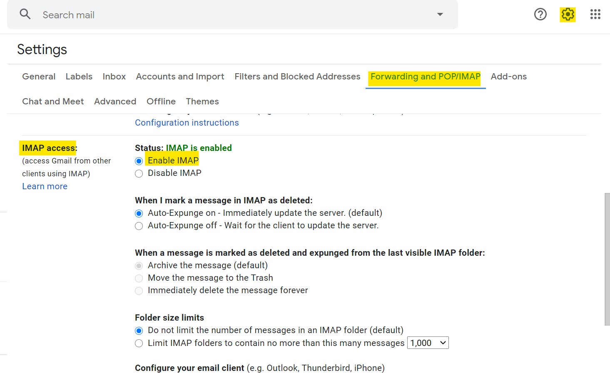
        
        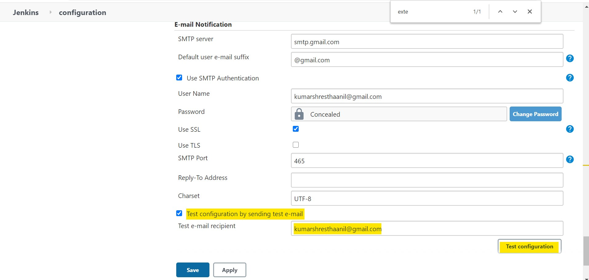
    5.    Click “Save” in the bottom of the page

2. Then, Go to your project and click on Configure as shown.
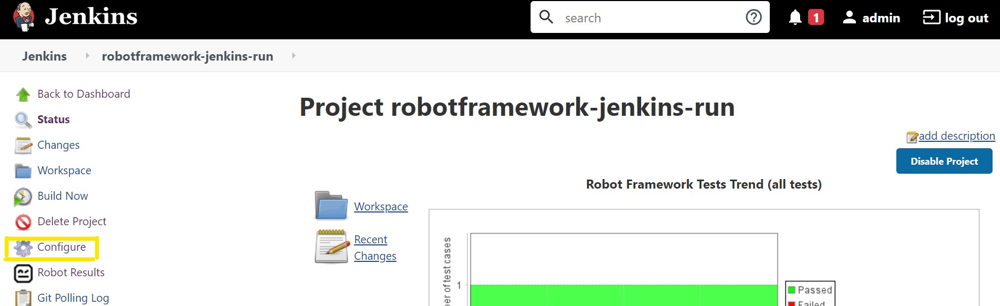

3. Go to Post-build Actions tab and click on "Add post build actions" list menu. You will see Editable email notification, click on that.
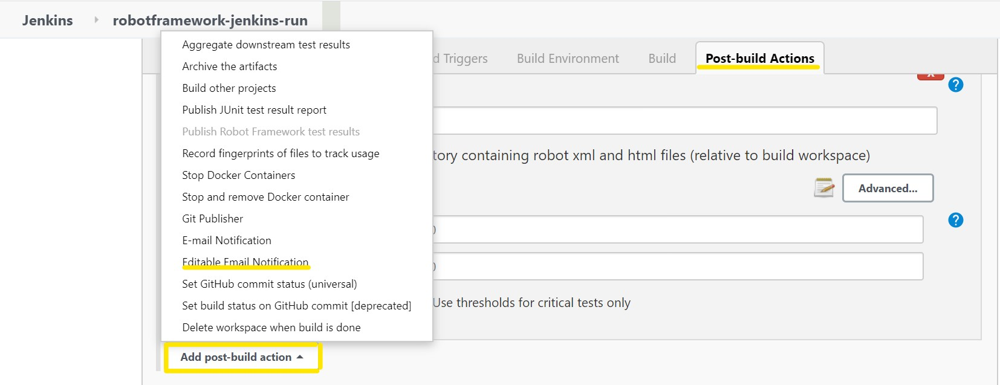

4. Now, you will see some information you can input for customizing the email.
    * Add the EmailID in Project from to show from where you are going to send the email. Similar to the recipient list.
    You can add customize message as shown.
    * You can attach output result file to the message through attachment section.
    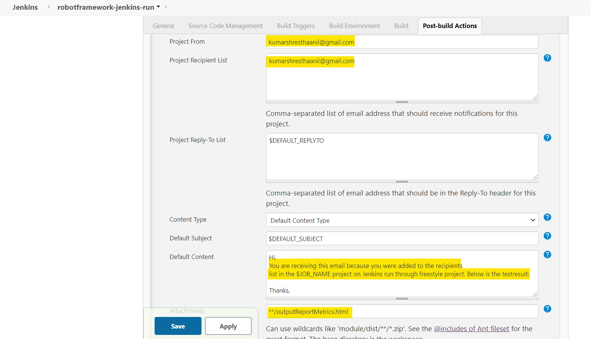
    * Go to Advance Setting as below for adding the recipient.                                                                                  
    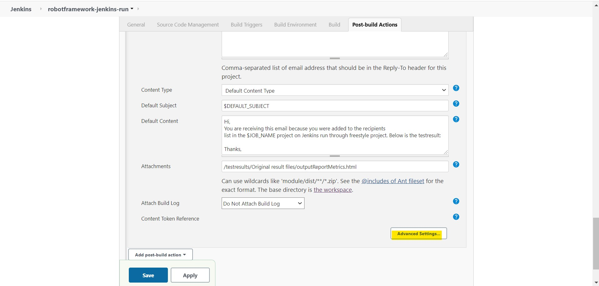
    * On the trigger section, click on Add and add Recipient list.
    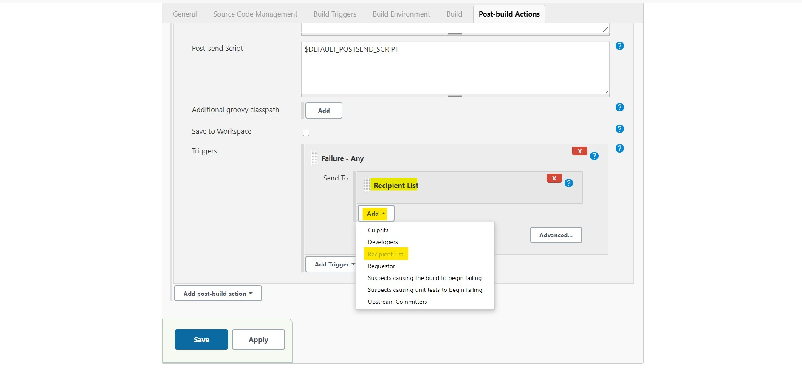
    * Click "Add Trigger", and select "Always" to add to Recipient list.
    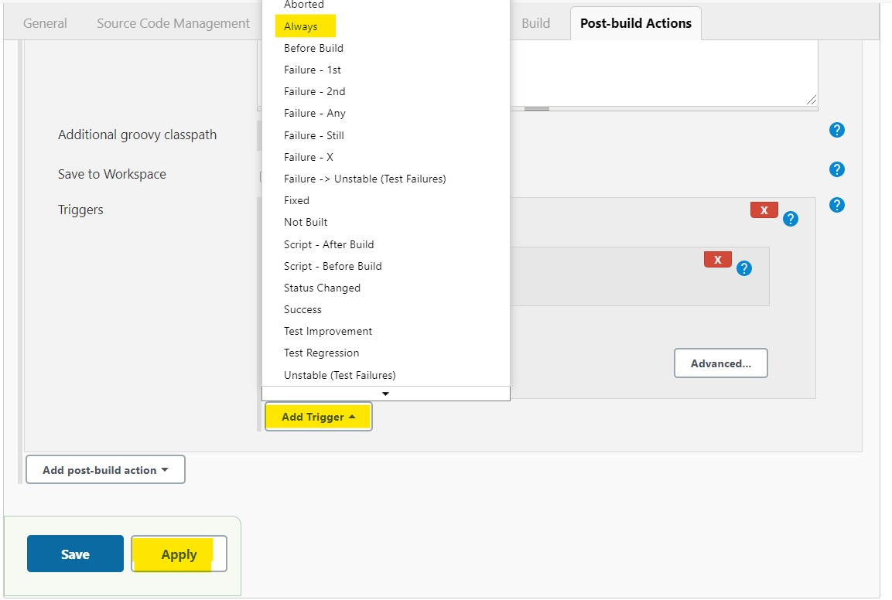
                                                                                                                                                                       
5. Click Apply and Save.
6. Click Build Now and enjoy your day.


## Troubleshooting report <a name="Troubleshoot_viewreport"></a>
If you get an error below while opening html. Please follow the steps.
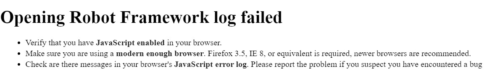

1. Try enabling javascript for browser. example for [chrome](https://support.google.com/adsense/answer/12654?hl=en). 
2. If that doesn't work :
> > * Go to C:\Program Files (x86)\Jenkins
> > * edit jenkins.xml file and add below code snippet in the file removing the existing one. 
```
<arguments>-Xrs -Xmx256m -Dhudson.lifecycle=hudson.lifecycle.WindowsServiceLifecycle -Dhudson.model.DirectoryBrowserSupport.CSP="" -jar "%BASE%\jenkins.war" --httpPort=8080 --webroot="%BASE%\war"</arguments>
```
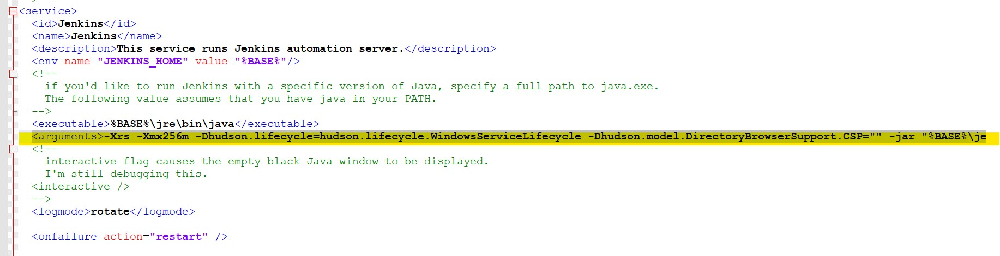